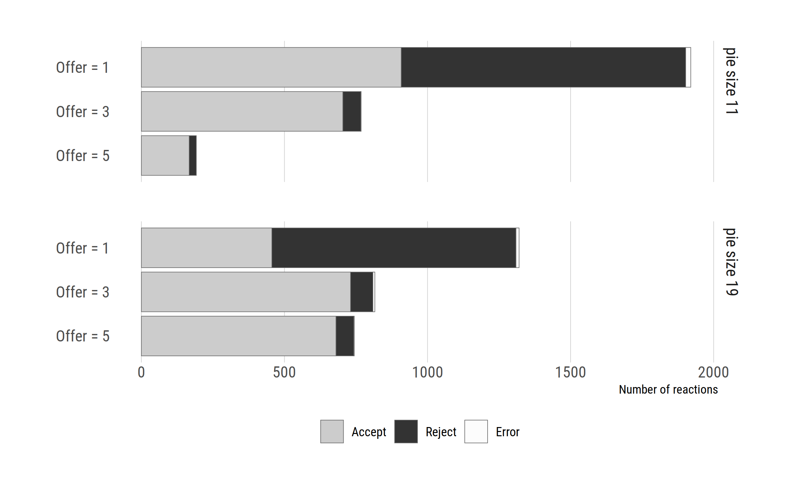
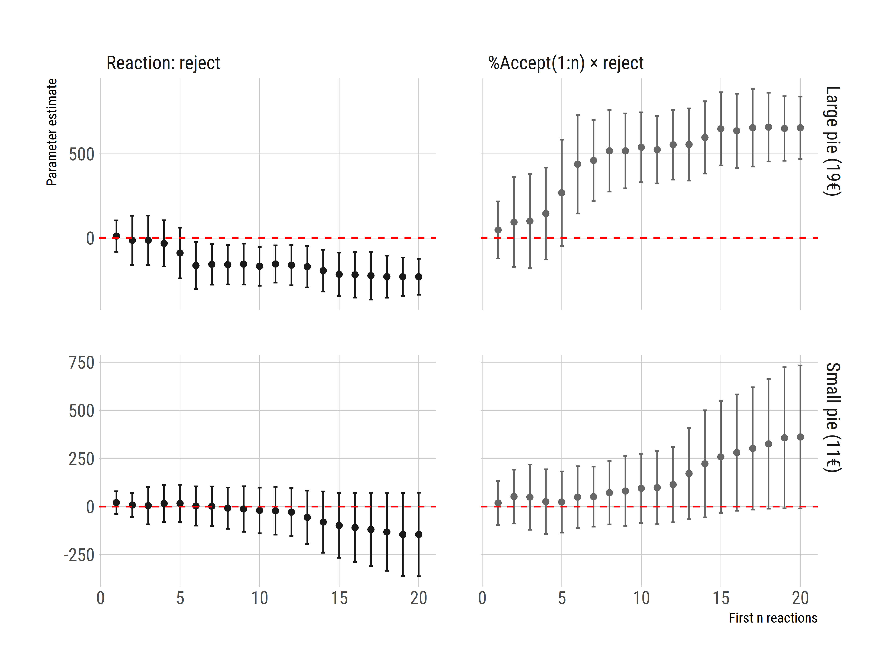

# Data and analysis scripts for "What are you calling intuitive -- Subject heterogeneity as a driver of response times in an impunity game" by Paolo Crosetto and Werner Güth

This repository contains all data and scripts to reproduce the analysis contained in the paper *What are you calling intuitive? Subject heterogeneity as a driver of response times in an impunity game*, by Paolo Crosetto and Werner Güth.

## How to run the analysis

The whole analysis is contained in the file Analysis.R. This file calls all other R files. These analysis subfiles are stored in `/Subfiles`. Figures are saved in the `/Figure` subfolder, Tables in `/Tables`. The data for the respondent and the proposer are located in `/Data`. Tests are run inline and you need to execute the respective .R analysis subfile to see them appear in your console.

## The Paper

#### Preprint

There are two version of the paper.

-   A first preprint, that also appeared as a Grenoble GAEL Working Paper, features analyses of both the proposers and respondents. It gives a complete account of all our data and you can find it here: [Working Paper Version](Paper/Crosetto-Gueth-Working-paper-version.pdf)

-   A second, revised version has been shortened to 3500 words, focus exclusively on respondent behavior and response time, and features panel regressions and robustness checks. You can find it here: [Revised version](Paper/Crosetto-Gueth-Revised-shortened-version.pdf)

#### Abstract

*Studies on the intuitive or deliberate nature of human actions often use time constraints for identification, assuming that constrained individuals fall back to intuitive behavior. This identification strategy disregards individual heterogeneity and self-priming, i.e. the behavioral rule that subjects can form during the instructions phase, and then apply irrespective of the time constraint.*

*We use respondent data from an impunity game as an example of how subject heterogeneity can drive results. 24 respondents face 240 more or less unfair allocation proposals out of a small or large pie and can accept or reject the offer. Upon rejection respondents burn their own money, but not the proposer's. Respondents decisions are communicated to the proposer.*

*On average, emotional rejections take longer than deliberate acceptances. Including individual heterogeneity, though, we find that subjects who mostly accept (reject) take more time to reject (accept). Faster decisions are the ones conforming with the modal early reaction. We attribute this finding to heterogeneity in self-priming. Since self-priming is orthogonal to time constraints, it has the capacity to invalidate their use in the identification of dual decision modes.*

#### Data

The paper analyses data from an *impunity game* experiment ran in 2011 over two different laboratories:

-   the Max Planck Experimental Economics Laboratory in Jena, where *proposer* participants decided how to split a pie of 11 or 19 € with a *respondent*. [Proposer data](Data/proposers.csv)

-   the fMRI scanner of the Klinikum der Universität Jena, where *respondents* faced all offers by proposers and decided either to *accept* the split or to *reject* it, in which case they burned their own money to send a message to the proposer. [Respondent data](Data/respondents.csv)

Proposers were then notified by email of the reaction of the respondent, that had no monetary consequences for them.

#### Results in a nutshell

##### Proposers

Proposers are mostly opportunists, choosing the minimal offer and hence maximising their share of the pie. Still, a sizable share of proposers offers non-minimal shares. A large minority of proposer know that their low offer is likely to be rejected, but they choose the lowest amount nonetheless.

##### Respondents

Respondents mostly accept offers, but minimal, 1€ offers are rejected nearly half of the time. The aggregate behavior is driven by large individual heterogeneity. We can identify three types of respondents: opportunistic respondents, always accepting no matter the offer and the original pie size; fairness-minded subjects, always rejecting small offers; and monotonic subjects, whereby the likelihood of rejecting depends on the size of the original pie to be shared. Three subjects could not be cateogrized and fall into a residual category.

##### Response time

Rejections take longer than acceptances. This is at odds with most literature, as the 'emotional'/'intuitive' reply here is to reject, while the rational/opportunistic reply is to accept. Crucially, response times are driven by heterogeneity, too. Opportunistic types take less time to accept than to reject, while fairness minded types take less time to reject. In general, across all subjects, the most likely reaction takes *less* time than the least favored one. Subjects likely choose a course of actions and it is taxing to deviate from it.

We show this via a series of fixed effects panel regressions, where we estimate the impact of the *n* initial responses on response time by type of response on the remainder of the data, varying *n* from 1 (the very first reply) to 20 (the mean acceptance rate over the first 20 responses). Result show that the very first responses determine the overall response pattern and the reaction times -- the *self-primed* response that is modal in the first *n* responses is later on taken faster than the opposite response. The result is already apparent looking at the first 5 responses.

